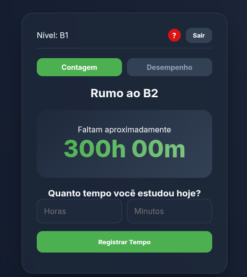

# 🚀 Fluency Tracker

O **Fluency Tracker** é uma aplicação web desenvolvida para estudantes de idiomas que desejam gamificar seu aprendizado. Baseado no quadro europeu de níveis (A1, A2, B1...), o app permite registrar horas de estudo, visualizar o progresso em gráficos e saber exatamente quanto falta para o próximo nível.

---

## ✨ Funcionalidades

- **Autenticação Real:** Login e cadastro seguro via Firebase Auth.
- **Gráficos de Desempenho:** Visualização diária de minutos estudados usando Chart.js.
- **Sistema de Níveis:** Cálculo automático de progresso (ex: A2 para B1).
- **Interface Moderna:** Design responsivo com Glassmorphism e Dark Mode.
- **Persistence:** Seus dados ficam salvos na nuvem (Firebase Realtime Database).

## 🛠️ Tecnologias Utilizadas

- **Frontend:** HTML5, CSS3 (Custom Properties), JavaScript (ES6 Modules).
- **Backend/DB:** Firebase (Auth & Realtime Database).
- **Gráficos:** [Chart.js](https://www.chartjs.org/).
- **Deploy:** [Vercel](https://vercel.com/).

## 🔗 Link do Projeto

Você pode acessar a aplicação pronta para uso aqui:
> **[Acessar Fluency Tracker 🚀](https://fluency-tracker.vercel.app/)**

---

## 📸 Screenshots
